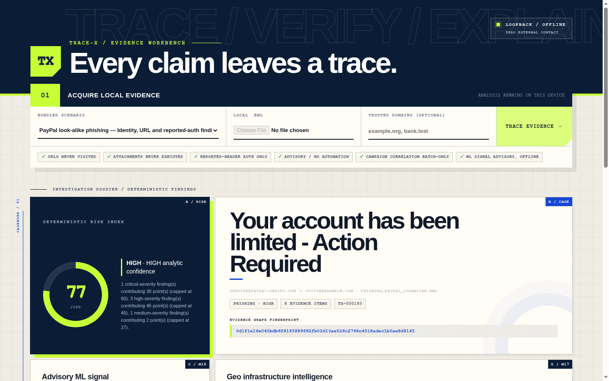
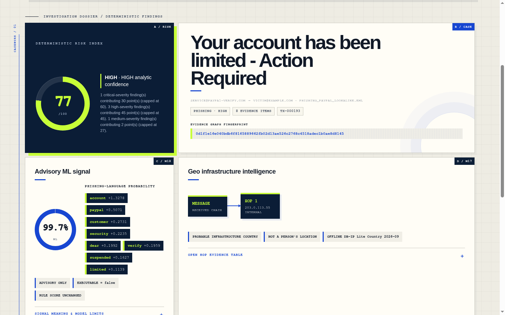
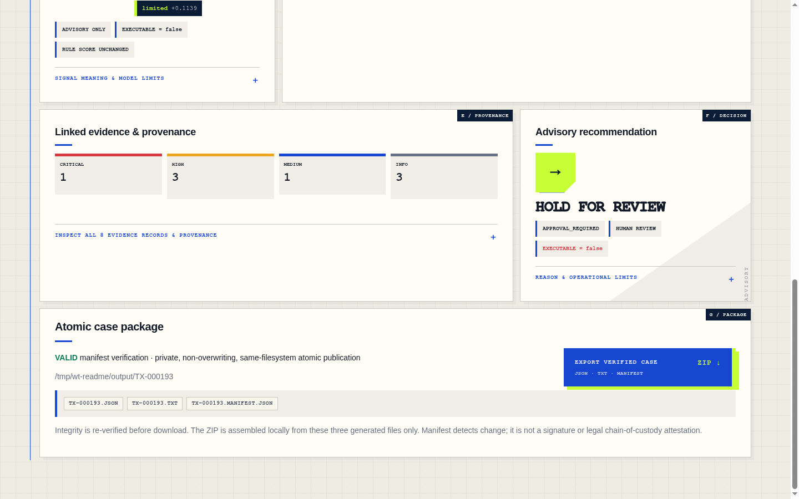
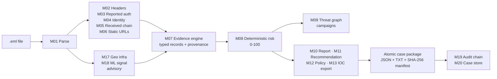

<div align="center">



# TRACE-X

### Every claim leaves a trace.

**Offline email forensics for analysts who have to explain their verdict.**
Drop in a `.eml`. Get a 0-100 risk score where every point traces back to a piece of evidence - and a tool that tells you plainly what it did not check.


Smart India Hackathon 2026 entry · Problem statement **SIH26106** · Team **Zyronith**
🥉 3rd place, IdeaSense (cash prize)

[Quick start](#quick-start) · [How it works](#how-it-works) · [Modules](#the-20-modules) · [Honesty boundary](#honesty-boundary) · [Validation](#validation) · [Roadmap](#roadmap)

</div>

---

## Why TRACE-X

Most phishing tools give you a verdict. TRACE-X gives you a **case file**.

| Principle | What it means |
|---|---|
| **Evidence first** | Every finding is a typed evidence record with its source, severity and provenance. The score is computed from those records by fixed rules, so the same email always gets the same score and you can see why. |
| **Offline by design** | Analysis never visits a URL, never executes an attachment and never calls a cloud service. The console binds to `127.0.0.1` only. |
| **Honest about limits** | SPF/DKIM/DMARC are read from the headers the message reports - TRACE-X says "reported", never "verified". The ML signal is labelled advisory and cannot move the rule score. |
| **Human in the loop** | Recommendations ship with `executable = false`. TRACE-X suggests; an analyst decides. |
| **Tamper-evident output** | Each case is published atomically with a SHA-256 manifest, and every analysis is appended to a hash-chained local audit journal you can verify. |

## See it work

The bundled PayPal look-alike scenario, analysed end to end in the local console:

<table>
<tr>
<td width="50%"></td>
<td width="50%"></td>
</tr>
<tr>
<td><b>Signals.</b> The M18 language model shows which words drove its probability. M17 maps the mail hops to a probable infrastructure country from an offline database.</td>
<td><b>Decision.</b> 8 evidence records by severity, a non-executable <i>HOLD FOR REVIEW</i> recommendation, and a case package whose hashes are re-checked before export.</td>
</tr>
</table>

Same email from the CLI:

```text
$ python cli.py analyze test_data/phishing/phishing_paypal_lookalike.eml

RISK:                   HIGH  (score: 77/100)
THREAT CLASSIFICATION:  PHISHING  (confidence: HIGH)

TOP FINDINGS:
  [CRITICAL] Suspicious URL structure detected: Uses insecure HTTP scheme;
             Contains suspicious keyword(s): login, secure, verify
  [HIGH]     Display name references brand 'paypal' but From domain does not
             match that brand's known domains
  [HIGH]     DMARC result: fail
  [HIGH]     SPF result: fail
  [MEDIUM]   DKIM result: none
  [INFO]     Advisory ML phishing-language probability
```

The legitimate newsletter fixture scores **0/100, LOW, CLEAN** through the same pipeline.

## Quick start

**Windows, one click:** run `START-TRACE-X.bat`. It creates `.venv`, installs dependencies and opens the console at `http://127.0.0.1:8765/`. First run needs internet to install packages; analysis itself is offline.

**Any OS, Python 3.11:**

```bash
git clone https://github.com/TechnoDisaster63/TRACE-X.git
cd TRACE-X
python -m venv .venv
source .venv/bin/activate          # Windows: .\.venv\Scripts\Activate.ps1
pip install -r requirements.txt -r requirements-ml.txt
python -m pytest -q                # expect: 335 passed
python demo.py                     # console on http://127.0.0.1:8765/
```

Then try the CLI:

```bash
python cli.py analyze test_data/phishing/phishing_paypal_lookalike.eml   # 77 / HIGH
python cli.py analyze test_data/legitimate/legit_newsletter.eml          # 0 / LOW
python cli.py campaign test_data/campaign                                # 3-message campaign
python cli.py verify-audit                                               # audit chain
```

<details>
<summary><b>All CLI commands</b></summary>

| Command | What it does |
|---|---|
| `analyze` | Analyse one `.eml` file |
| `analyze-folder` | Analyse every `.eml` in a folder |
| `campaign` | Analyse a folder and correlate the messages into campaigns |
| `verify-case` | Re-verify a saved case manifest and its artifacts |
| `export-ioc` | Export evidence-backed indicators for offline review |
| `feedback` | Write an immutable analyst-feedback record |
| `lifecycle` | Create or advance an advisory recommendation lifecycle record |
| `verify-audit` | Verify the append-only, hash-chained audit journal |
| `correlate-history` | Correlate every case in the local case store |
| `watch-folder` | Poll a local folder and analyse each new `.eml` once |

</details>

## How it works



The score comes from the rule-based evidence. M18 never changes it, and M17 country evidence is INFO-level, which carries 0 points.

## The 20 modules

| # | Module | What it does |
|---|---|---|
| M01 | EML parser | Parses structure, headers, bodies and attachment metadata; fails safe on malformed input |
| M02 | Header forensics | Flags header anomalies and inconsistencies |
| M03 | Auth analyzer | Interprets **reported** SPF/DKIM/DMARC results from headers |
| M04 | Identity analyzer | Display-name vs. domain mismatches, brand look-alikes |
| M05 | Received chain | Rebuilds the mail path from `Received` headers |
| M06 | URL analyzer | Static URL features; links are parsed, never opened |
| M07 | Evidence engine | Normalises findings into typed evidence with provenance |
| M08 | Risk engine | Deterministic, capped, explainable 0-100 score |
| M09 | Threat graph | Batch campaign correlation with exact supporting case IDs |
| M10 | Report generator | JSON and human-readable text reports |
| M11 | Recommendation | Typed advisory recommendation, always `executable=false` |
| M12 | Trust policy | Deterministic trusted-domain and policy evaluation |
| M13 | IOC export | Offline, evidence-backed indicator export |
| M14 | Analyst feedback | Immutable feedback records |
| M16 | Prevention audit | Hash-linked recommendation lifecycle records; records facts, never acts |
| M17 | Geo infra intel | Probable country of public mail-hop IPs from offline DB-IP Lite |
| M18 | ML phishing signal | Optional advisory phishing-language probability with driving tokens |
| M19 | Audit chain | Append-only, hash-chained local audit journal |
| M20 | Case store | Local SQLite case index for correlation across runs |
| M21 | Folder ingest | Polls a local folder and analyses new `.eml` files |

**M15 is intentionally absent.** It would be live action adapters (blocking, quarantining). TRACE-X does not take actions, so there is no M15.

## Honesty boundary

These are design rules, not fine print.

- **Authentication is reported-header analysis.** TRACE-X reads the SPF/DKIM/DMARC results written into the message headers. It does not re-run DNS lookups or verify signatures.
- **URLs are parsed, never visited.** Attachments are hashed and inspected as metadata, never executed.
- **M17 is infrastructure, not people.** It reports the probable country of a mail server IP. It is not a sender's location and not attribution. No ASN, WHOIS or reputation data.
- **M18 is advisory.** It never changes the rule score. Its published numbers come from historical corpora (see below), not from current mail.
- **Recommendations don't execute.** Every recommendation is `executable=false` and needs a human.
- **Manifests detect change.** They are not digital signatures and not a legal chain-of-custody attestation. The audit journal is a tamper-evident local ledger, not a blockchain.
- **No live integrations.** No mailbox connection, mail gateway, SIEM/SOAR, cloud service or external API. The only database is the local SQLite case index.

## Validation

- **335 tests passing** on `main` (commit `d6c7a68`, 2026-09-23). CI runs the full suite on Python 3.11 with hash-locked dependencies on every pull request and every push to `main`.
- Coverage includes every implemented module, the local console, verified ZIP export, unsafe and unknown export IDs, malformed input, safety invariants and integration scenarios.
- Bundled fixtures are **synthetic**: legitimate, phishing, BEC, look-alike, malformed and a three-message campaign.

### M18 model: what the numbers do and don't mean

M18 was trained on the public Nazario phishing corpus and SpamAssassin `easy_ham` - roughly 2005-2007 mail. On a held-out 648-message test split it scored precision 1.00, recall 0.98, F1 0.99.

That is a result **on old, clean corpora**. It is not field accuracy and says nothing yet about 2026 phishing. A source-disjoint, time-aware evaluation on modern mail is planned in [`docs/M18_DATASET_CARD.md`](docs/M18_DATASET_CARD.md). No modern score is claimed until it has been run.

## Roadmap

- **Modern M18 evaluation** - locked 2025-26 challenge set, source-disjoint splits, confidence intervals. See the dataset card.
- **Large-scale false-positive test** on real legitimate mail, published with method and raw counts.
- Live action adapters (M15) stay out of scope until there is a human-approval design worth shipping.

Full list: [`docs/project/ROADMAP.md`](docs/project/ROADMAP.md).

## Repository map

```text
cli.py, demo.py          CLI and loopback-only console server
core/pipeline.py         analysis, atomic case publication, verification
modules/                 M01-M14, M16-M21
demo_ui/                 console front end
test_data/               synthetic regression fixtures
tests/                   test suite
docs/                    architecture, security model, threat model, test plan, reports
```

Good places to start: [Implementation status](docs/project/IMPLEMENTATION_STATUS.md) · [Limitations and non-goals](docs/security/LIMITATIONS_AND_NON_GOALS.md) · [Threat model](docs/security/THREAT_MODEL.md) · [Demo guide](docs/guides/HACKATHON_DEMO.md)

## Credits

Built by **Sabari T** (team lead) and **Team Zyronith**.
M17 uses the [DB-IP Lite Country](https://db-ip.com/db/download/ip-to-country-lite) database (2026-09) by DB-IP.com, licensed [CC BY 4.0](https://creativecommons.org/licenses/by/4.0/).

## License

No license has been chosen yet. Until a `LICENSE` file is added, all rights are reserved.
